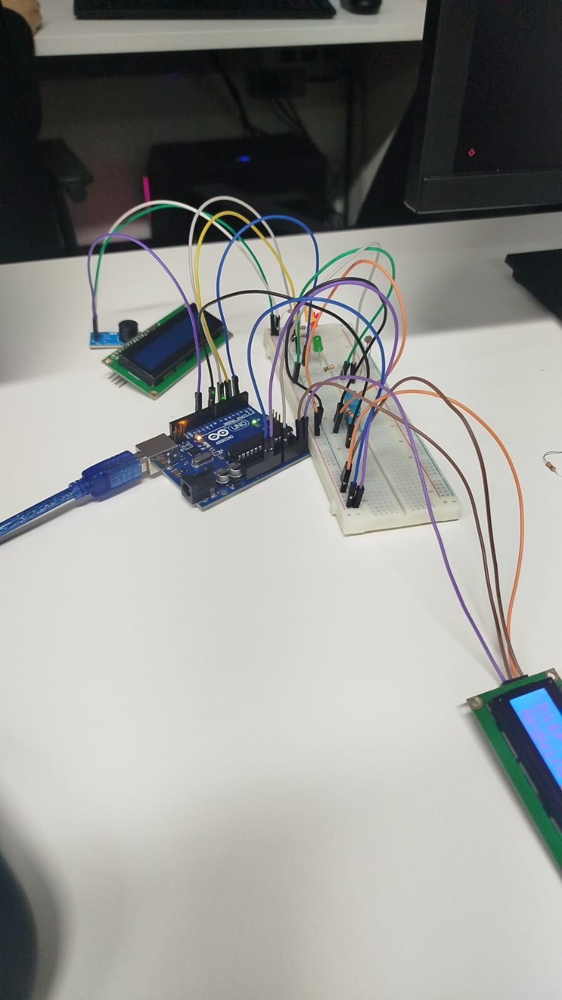

# 🍷 Projeto Vinheria: Monitoramento Ambiental Inteligente

## 📘 Descrição do Projeto

Este projeto foi desenvolvido como parte do projeto da Vinheria Agnello, que é uma Vinheria tradicional que está expandindo suas operações para o e-commerce. Para garantir que a experiência que o cliente terá na loja virtual se aproxime ao máximo do atendimento físico e da qualidade dos vinhos preservada na loja, foi proposto um sistema inteligente de monitoramento ambiental.
O sistema visa controlar os principais fatores que afetam a qualidade do vinho: **luminosidade**, **temperatura** e **umidade**. Através do uso de sensores e componentes eletrônicos conectados a uma placa Arduino, o ambiente da vinheria poderá ser monitorado continuamente, garantindo condições ideais de armazenamento.

---

## 🎯 Objetivo

Criar um sistema de monitoramento ambiental utilizando Arduino, sensores e atuadores, que permita:

- Acompanhar em tempo real os níveis de luminosidade, temperatura e umidade;
- Informar visualmente e sonoramente caso essas variáveis estiverem fora das faixas ideais;
- Apresentar os dados de forma clara em um display LCD, simulando um ambiente de controle semelhante ao cuidado presencial com os vinhos.

---

## 🛠 Tecnologias e Componentes Utilizados

- **Placa Arduino UNO**
- **Sensor de Temperatura e Umidade DHT11**
- **Sensor de Luminosidade (LDR)**
- **Display LCD 16x2**
- **LEDs (Verde, Amarelo, Vermelho)**
- **Buzzer**
- **Resistores, jumpers e protoboard**

---

## 🧠 Lógica de Funcionamento

### 🔆 Luminosidade

| Condição                | Ação                                                                 |
|-------------------------|----------------------------------------------------------------------|
| Ambiente escuro         | LED verde aceso                                                     |
| Meia luz                | LED amarelo aceso + "Ambiente a meia luz" no LCD                    |
| Ambiente muito claro    | LED vermelho aceso + "Ambiente muito claro" no LCD + Buzzer ligado  |

### 🌡 Temperatura

| Faixa de Temperatura | Ação                                                                      |
|----------------------|---------------------------------------------------------------------------|
| Entre 10°C e 15°C    | LCD: "Temperatura OK" + valor temp.                                             |
| Abaixo de 10°C       | LED amarelo + LCD: "Temp. Baixa" + valor temp. + Buzzer                        |
| Acima de 15°C        | LED amarelo + LCD: "Temp. Alta" + valor temp. + Buzzer                         |

### 💧 Umidade

| Faixa de Umidade     | Ação                                                                      |
|----------------------|---------------------------------------------------------------------------|
| Entre 50% e 70%      | LCD: "Umidade OK" + valor umidade                                                 |
| Abaixo de 50%        | LED vermelho + LCD: "Umidade Baixa" + valor umidade + Buzzer                      |
| Acima de 70%         | LED vermelho + LCD: "Umidade Alta" + valor umidade + Buzzer                       |

### 📊 Funcionamento da apresentação

- As leituras dos sensores são feitas em tempo real.
- Os valores exibidos no LCD são a **média de pelo menos 5 leituras**.
- Os dados são atualizados no display a **cada 5 segundos**.

---

## 🧪 Instalação e Execução

### 1. Preparação do Ambiente

- Instale a IDE do Arduino: [Arduino IDE](https://www.arduino.cc/en/software)
- Abra a IDE do Arduino
  - Instale a biblioteca do **DHT11 e LiquidCrystal I2C**:
    - Vá em **Sketch** > **Incluir Biblioteca** > **Gerenciar Bibliotecas**
    - Procure por "DHT sensor library e LiquidCrystal I2C" (Autores: Adafruit e Frank, respectivavmente) e clique em **Instalar**

### 2. Montagem dos Componentes

Monte o circuito em uma protoboard, conectando:

- O sensor DHT11 à porta digital do Arduino
- O LDR com divisor de tensão (resistor) em uma porta analógica
- LEDs nas portas digitais (com resistores)
- Display LCD utilizando barramento I2C ou conexão direta
- Buzzer à porta digital

### 3. Upload do Código

- Conecte o Arduino ao computador via cabo USB
- Carregue o código-fonte .ino através da IDE
- O sistema iniciará automaticamente a leitura e controle dos parâmetros ambientais

---

## 👥 Equipe

**Integrantes:**

Paulo Henrique Souza Vieira RM:566240

Pedro Albuquerque Drumond RM:566255

Vitor Mezzanotte Constante RM:562051

Artur Disrutti Santos RM:561319

---

## 📎 Anexos

📷**Imagem do Projeto Montado**

 <p align="center">
 
 </p>

 💻**Código-Fonte**


```
  void loop()
  {
    digitalWrite(11,HIGH);
    valorLumi = analogRead(A0);
    Serial.println(valorLumi);
    if(valorLumi >= 250){
      //valorLumi = analogRead(A0);
      digitalWrite(2,HIGH);
      digitalWrite(6,LOW);
      digitalWrite(4,LOW);
      digitalWrite(11,LOW);
      checaTemperatura();
      checaUmidade();
    }
    else if(valorLumi < 250 && valorLumi > 125){
      //valorLumi = analogRead(A0);
      digitalWrite(4,HIGH);
      lcd.clear();
      lcd.setCursor(0,0);
      lcd.print("Ambiente:"); 
      lcd.setCursor(0,1);
      lcd.print("a meia luz");
      digitalWrite(2,LOW);
      digitalWrite(6,LOW);
      digitalWrite(11,LOW);
      delay(3000);
      checaTemperatura();
      checaUmidade();
    }
    else if(valorLumi <= 125 ){
      //valorLumi = analogRead(A0);
      digitalWrite(6,HIGH);
      lcd.clear();
      lcd.setCursor(0,0);
      lcd.print("Ambiente:"); 
      lcd.setCursor(0,1);
      lcd.print("muito claro");
      digitalWrite(11,HIGH);
      digitalWrite(4,LOW);
      digitalWrite(2,LOW);
      delay(3000);
      checaTemperatura();
      checaUmidade();
    }
    lcd.clear();
  }
